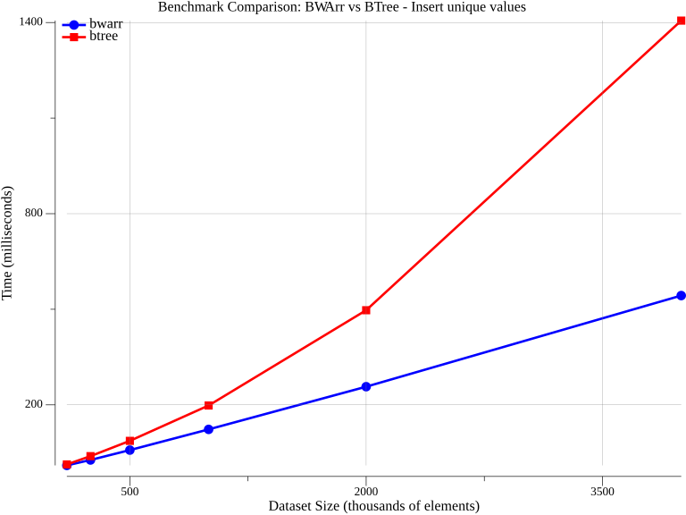
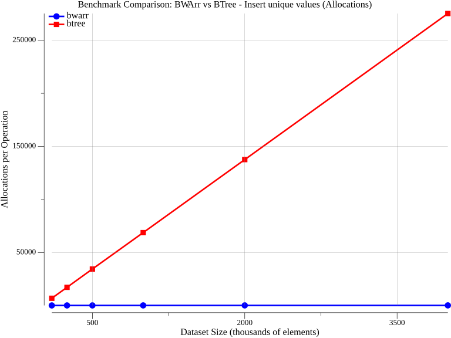
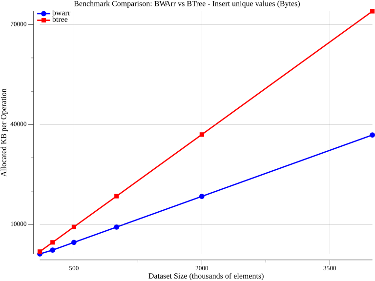
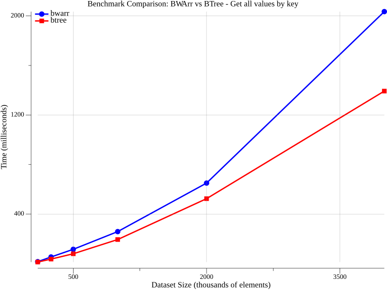
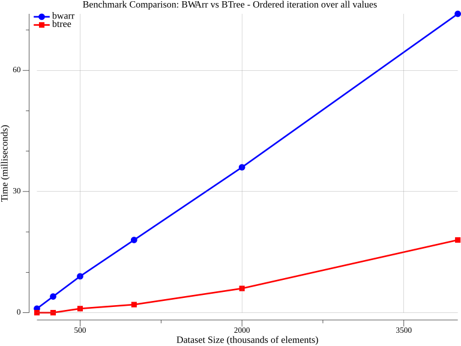
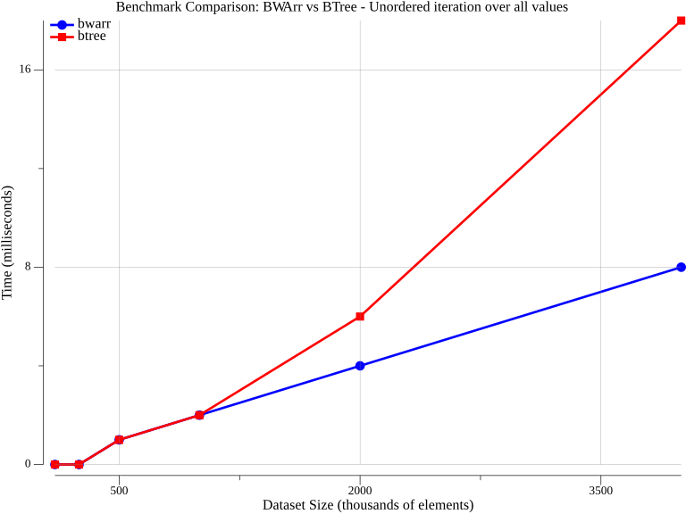
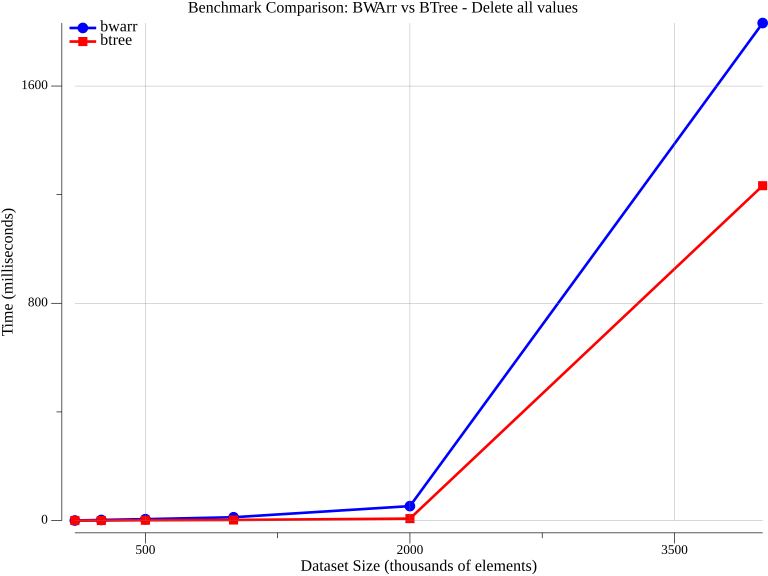

# Benchmark Results

Performance comparison between [BWArr](https://github.com/dronnix/bwarr) and [Google BTree](https://github.com/google/btree) data structures across various operations.

**Test Environment:**
- Go 1.25.5
- BTree degree: 32
- Dataset sizes: 100K, 250K, 500K, 1M, 2M, 4M elements
- Random values: Full int64 range (math.MaxInt64)

---

## Write Operations

### Insert Unique Values

Measures the time to insert N unique random int64 values into an empty data structure. Both BWArr and BTree start empty and insert all values one by one.

**What's measured:**
- Time per operation (milliseconds)
- Number of allocations per operation
- Bytes allocated per operation

**Setup:** Fresh empty data structure created for each iteration





---

## Read Operations

### Get All Values by Key

Measures the time to look up N values by their keys in a pre-populated data structure. The data structure is populated with all values before timing starts, then each value is retrieved by key.

**What's measured:**
- Time per operation (milliseconds)

**Setup:** Data structure pre-populated with all values, timing excludes setup



---

### Ordered Iteration Over All Values

Measures the time to iterate through all N values in sorted order. The data structure is pre-populated, and iteration yields values in ascending order.

**What's measured:**
- Time per operation (milliseconds)

**Setup:** Data structure pre-populated with all values



---

### Unordered Iteration Over All Values

Measures the time to iterate through all N values without ordering guarantees. BWArr can iterate in insertion order or unordered for better performance.

**What's measured:**
- Time per operation (milliseconds)

**Setup:** Data structure pre-populated with all values



---

## Delete Operations

### Delete All Values

Measures the time to delete N values from a pre-populated data structure. Each value is deleted one by one.

**What's measured:**
- Time per operation (milliseconds)

**Setup:** Data structure pre-populated with all values, timing excludes setup



---

## Running Benchmarks

To regenerate these graphs:

```bash
make run
```

Graphs are automatically saved to the `images/` directory.

To run standard Go benchmarks:

```bash
make bench       # Full benchmarks (10s each)
make bench-quick # Quick benchmarks (1s each)
```
