# Benchmark Results

Performance comparison between [BWArr](https://github.com/dronnix/bwarr) and [Google BTree](https://github.com/google/btree) data structures across various operations.

**Test Environment:**
- Go 1.26.8
- BTree degree: 32
- Dataset sizes: 100K, 250K, 500K, 1M, 2M, 4M elements
- Random values: Full int64 range (math.MaxInt64)
- Repetitions: 5 per data point, bwarr and btree interleaved; graphs show the mean, error bars show min..max
- GC: a full `runtime.GC()` runs in every setup window right before timing starts. GC cycles caused by the timed operation's own allocations are included in its time
- Raw per-repetition results: [results/benchmarks.txt](results/benchmarks.txt) (Go benchmark format, readable by `benchstat`)

---

## Write Operations

Insertion is split into two cases, because the two libraries do not offer the same
insert operations and a fair comparison depends on what the caller needs.

### Case 1: Insert, duplicates allowed

Measures the time to insert N unique random int64 values into an empty data structure,
one by one, using each library's plain insert. BWArr `Insert` is a true multiset insert:
it never searches for an existing element. BTree has no such operation, so it is measured
with `ReplaceOrInsert`, its only insert. On a dataset of unique values both end up doing
the same useful work, but the bwarr number here does **not** include a duplicate check.
Use this case if you do not care about duplicates (for example, storing event timestamps).

**What's measured:**
- Time per operation (milliseconds)
- Number of allocations per operation
- Bytes allocated per operation

**Setup:** Fresh empty data structure created for each iteration; a full GC runs before the timer restarts, so garbage from the previous iteration is not collected inside the timed section

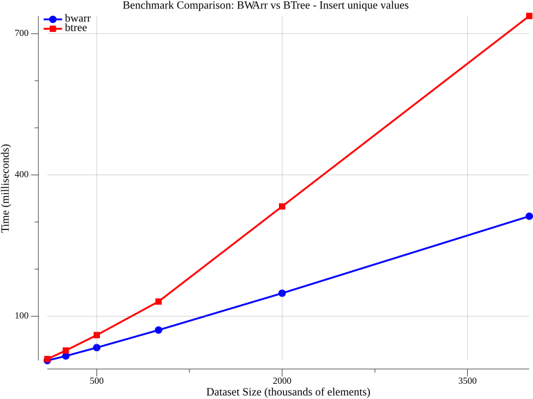
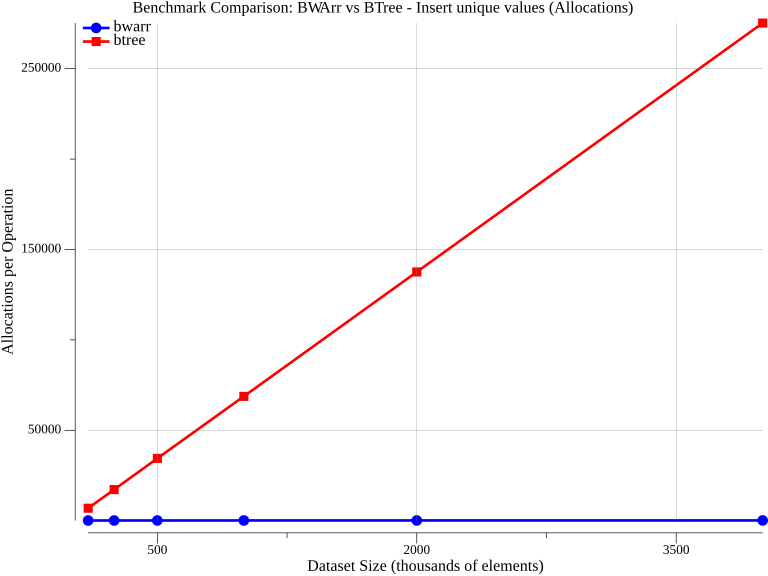
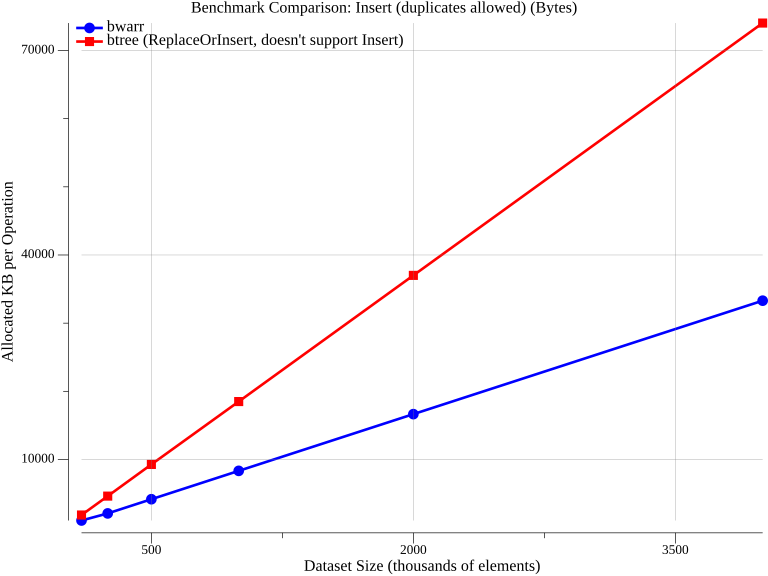

---

### Case 2: ReplaceOrInsert, unique collection

Same dataset as case 1, but both sides call `ReplaceOrInsert`, so the collection is kept
unique (set semantics). This is the like-for-like comparison and the number a user who
replaces btree with bwarr will observe. The gap between the bwarr lines of case 1 and
case 2 is the cost of the extra search bwarr must do to detect duplicates.

**What's measured:** time, allocations, bytes (as in case 1)

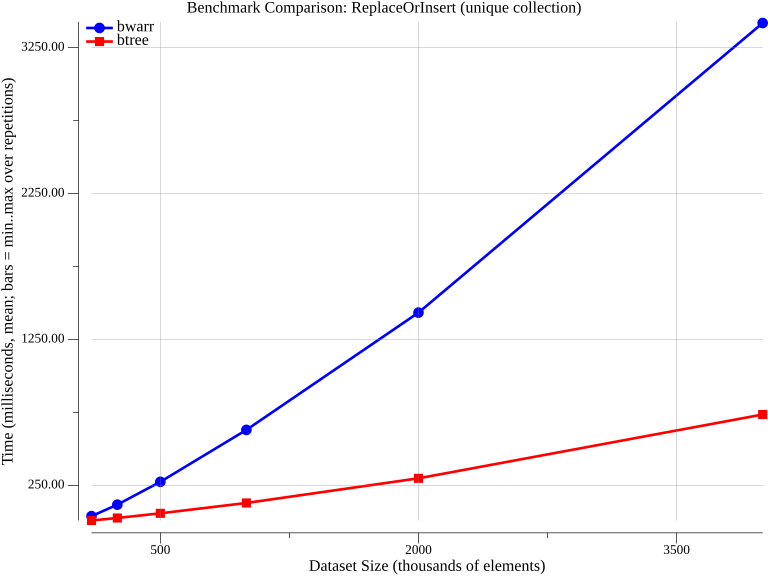
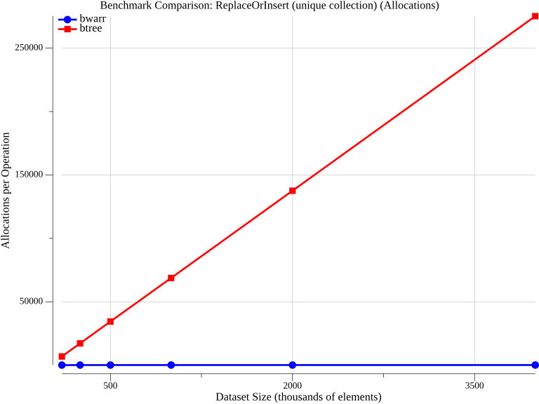
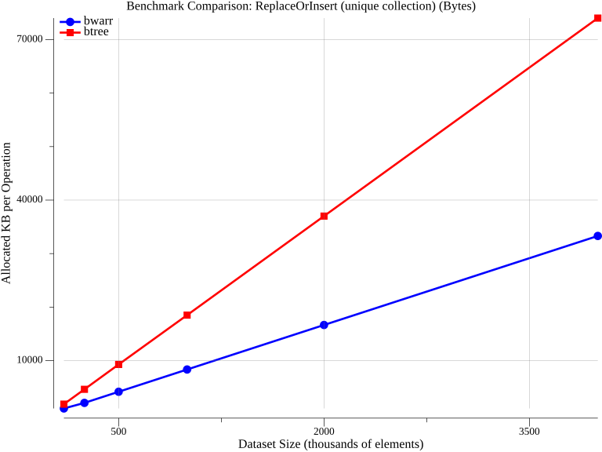

---

### Case 3: Insert sorted sequences (increasing and decreasing)

Same operations as case 1 (bwarr `Insert` vs btree `ReplaceOrInsert`), but the keys
arrive already sorted: `0, 1, ..., N-1` (increasing, like timestamps or auto-increment
IDs) and `N-1, ..., 1, 0` (decreasing). Every new key lands after (or before) all
existing ones. Sorted input is favourable for both libraries. In the B-tree the insert
path stays in cache, and the increasing case never shifts items inside a node, while
the decreasing case shifts items at the front of a node on every insert. In bwarr the
merge does the same work in either order, but the branches in the merge loop become
perfectly predictable. In the results both libraries run about 4x faster than on
random keys, and bwarr's time is the same for increasing and decreasing input.

**What's measured:** time per operation (milliseconds)

**Setup:** as in case 1

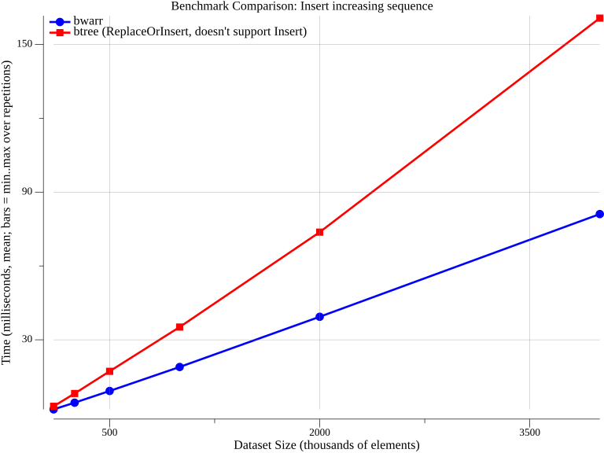
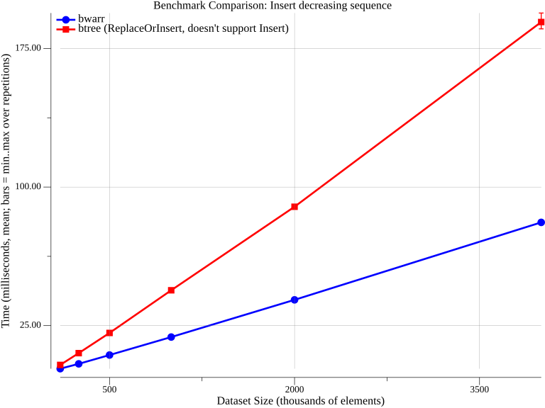

---

## Read Operations

### Get All Values by Key

Measures the time to look up N values by their keys in a pre-populated data structure. The data structure is populated with all values before timing starts, then each value is retrieved by key.

**What's measured:**
- Time per operation (milliseconds)

**Setup:** Data structure pre-populated with all values, then a full GC, then timing starts

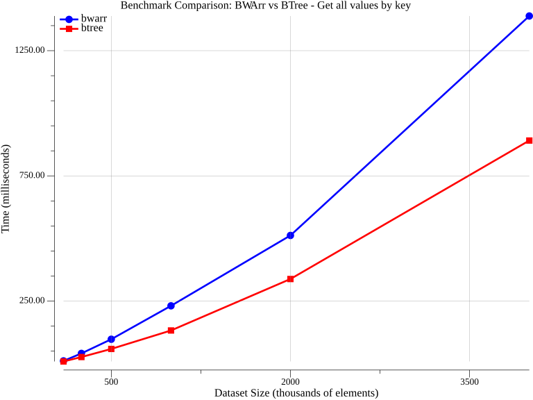

---

### Ordered Iteration Over All Values

Measures the time to iterate through all N values in sorted order. The data structure is pre-populated, and iteration yields values in ascending order.

**What's measured:**
- Time per operation (milliseconds)

**Setup:** Data structure pre-populated with all values, then a full GC, then timing starts

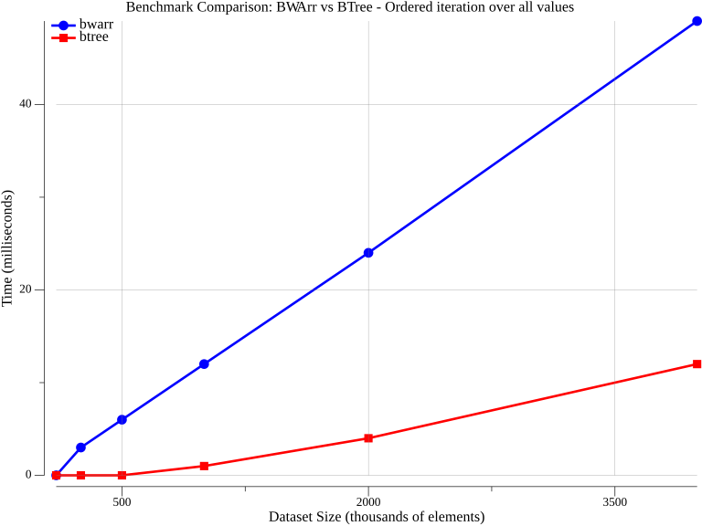

---

### Unordered Iteration Over All Values

Measures the time to iterate through all N values without ordering guarantees. BWArr has `UnorderedWalk` for this. BTree has no unordered walk, so its line is the ordered `Ascend` and is identical to the previous graph.

**What's measured:**
- Time per operation (milliseconds)

**Setup:** Data structure pre-populated with all values, then a full GC, then timing starts

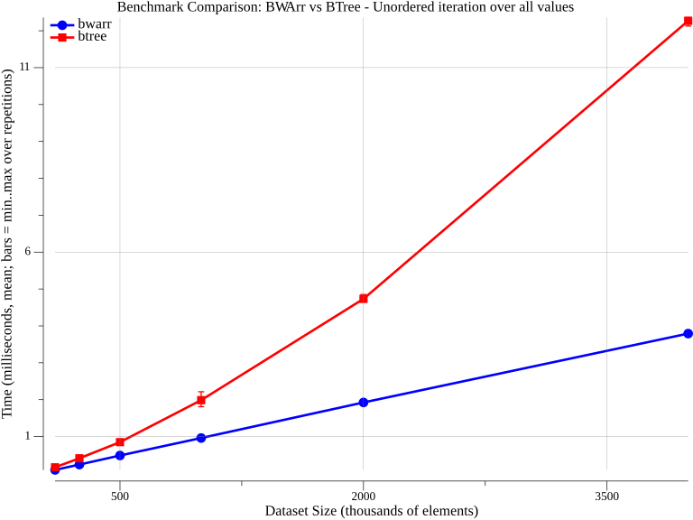

---

## Delete Operations

### Delete All Values

Measures the time to delete N values from a pre-populated data structure. Each value is deleted one by one.

**What's measured:**
- Time per operation (milliseconds)

**Setup:** Data structure pre-populated with all values, then a full GC, then timing starts

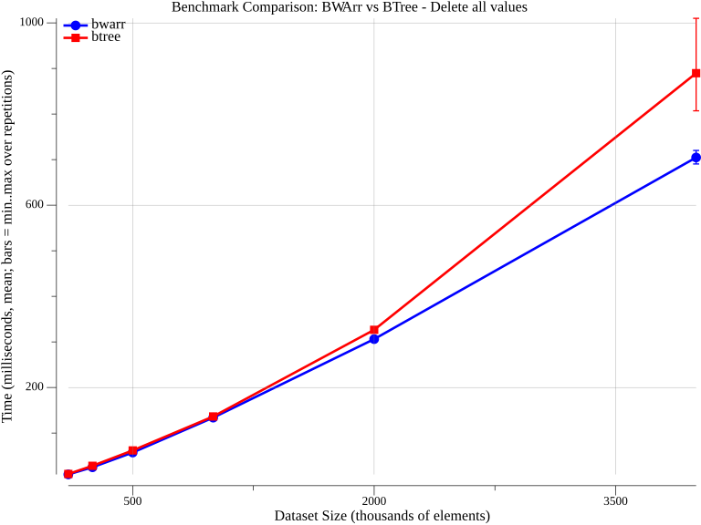

---

## Mixed Workload

### Insert, Get, Delete in ratio 1:1:1

Measures a mix of operations on a structure that is pre-populated with N random keys.
The workload applies N operations in total: N/3 inserts of new random keys, N/3 lookups
of existing keys and N/3 deletes of existing keys. The three kinds are interleaved in a
seeded random order, so the structure stays at about N elements the whole time and the
graph is comparable with the single-operation graphs above. Every lookup and every
delete hits an existing key.

The insert side follows case 1: bwarr uses its blind `Insert` (no duplicate check) and
btree uses `ReplaceOrInsert`, its only insert. The inserted keys are new, so both do
the same useful work.

In the results the two libraries are close at every size: bwarr is 1-9% faster, from
10.2 vs 10.3 ms at 100K to 873 vs 933 ms at 4M. bwarr's slower `Get` is balanced by its
faster `Insert`, and its `Delete` is on par with btree. Memory behaviour differs a lot:
bwarr makes about 9 allocations per run but they total 8 bytes per element (34 MB at
4M), because merges rebuild whole levels; btree makes about N/200 small node
allocations (20K at 4M) totalling 6 MB.

**What's measured:** time, allocations and bytes per operation (as in case 1), where one
operation is the whole sequence of N mixed operations

**Setup:** fresh data structure pre-populated with N keys for each iteration, then a full
GC, then timing starts

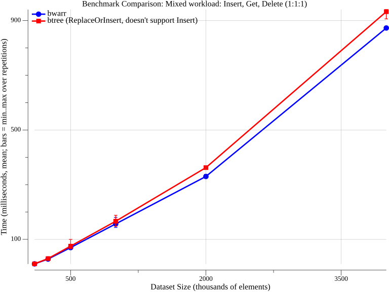
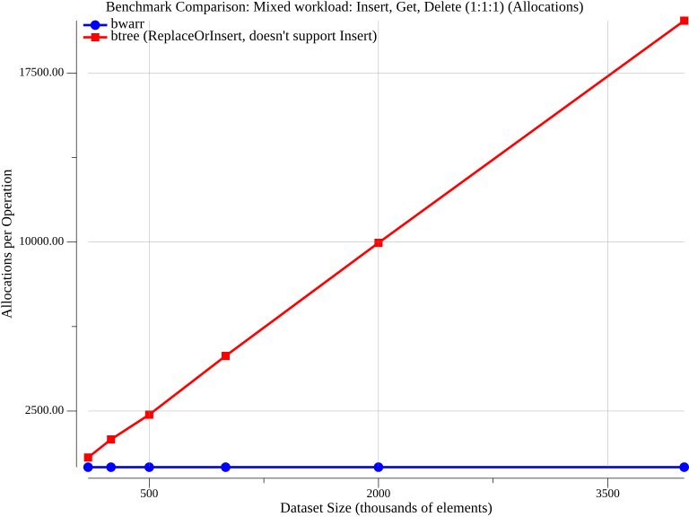
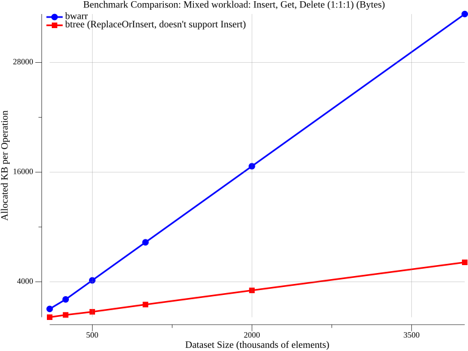

---

## Running Benchmarks

To regenerate these graphs:

```bash
make run
```

Graphs are automatically saved to the `images/` directory.

To run standard Go benchmarks:

```bash
make bench       # Full benchmarks (10s each)
make bench-quick # Quick benchmarks (1s each)
```
